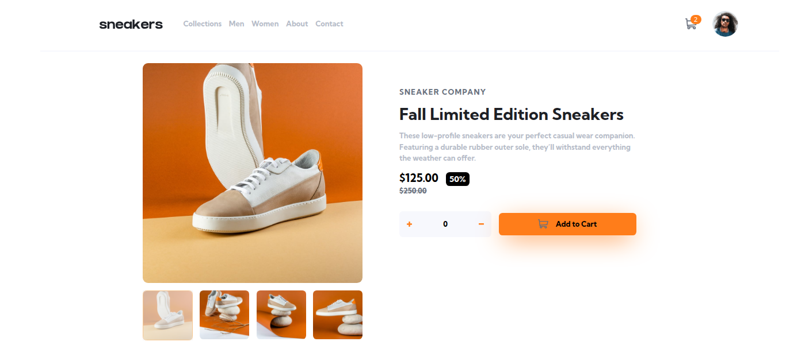
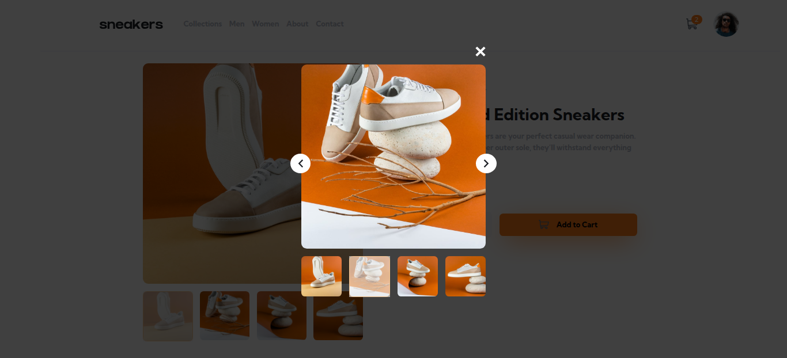
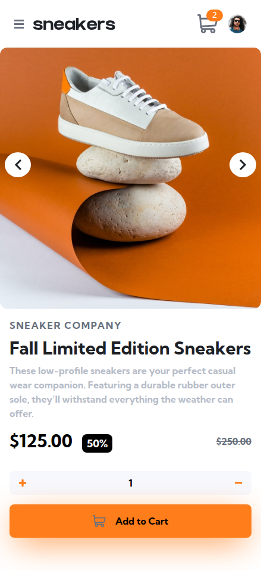

# Frontend Mentor - E-commerce product page solution

This is a solution to the [E-commerce product page challenge on Frontend Mentor](https://www.frontendmentor.io/challenges/ecommerce-product-page-UPsZ9MJp6).

## Table of contents

- [Overview](#overview)
  - [The challenge](#the-challenge)
  - [Links](#links)
  - [Screenshot](#screenshot)
- [My process](#my-process)
  - [Built with](#built-with)
- [Author](#author)

## Overview
### The challenge
Users should be able to:

- View the optimal layout for the site depending on their device's screen size
- See hover states for all interactive elements on the page
- Open a lightbox gallery by clicking on the large product image
- Switch the large product image by clicking on the small thumbnail images
- Add items to the cart
- View the cart and remove items from it
### Links

- Solution URL: [solution](https://github.com/Medido1/E-commerce-product-page)
- Live Site URL: [live site](https://ecommerceproductpagefront.netlify.app)

### Screenshot
  ## Desktop
  
  ## Lighbox Gallery
  
  ## Mobile
  
## My process

### Built with

- React
- Tailwindcss
- Flexbox
- Grid
- Mobile-first workflow
- Vanilla css

## Author

- Frontend Mentor - [@Medido1](https://www.frontendmentor.io/profile/Medido1)
- GitHub - [@Medido1](https://github.com/Medido1)